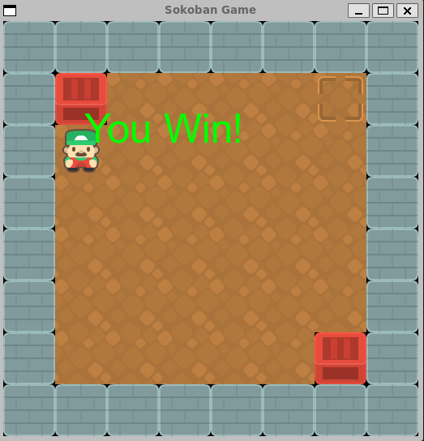

# Crate-Craze :bricks:
 
created by: Brandon Nguyen



## Summary :pencil2:

This project is a mimic of Sokoban (Japanese for warehouse keeper) which is a tile-based video game in which the player
controls a worker pushing boxes around a warehouse into their designated locations. It is
one of the earliest block-pushing video games, and has inspired many clones, derivatives, and
references

## Features :tada:

This program allows the user to control a character using (WASD) keys that allows the user to push crates to certain locations
on the level to essentially beat the level.

## Build :hammer_and_wrench:

Clone the repository:

```
git clone https://github.com/ThatGuyHieu/Crate-Craze.git
cd Crate-Craze
make
```

## Run :runner:

```
./Sokoban level[level of choice].txt
```
